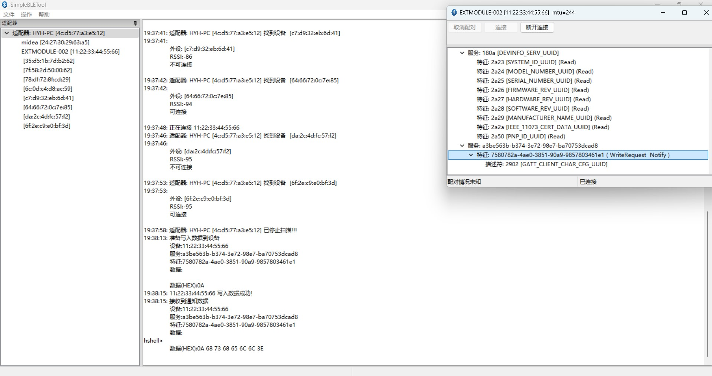

# 说明

简单BLE外设基础模板。

# 硬件

## 指示灯

| GPIO   | 说明 | 备注       |
| ------ | ---- | ---------- |
| GPIO34 | LED0 | 高电平驱动 |

## 应用串口

应用串口可用于与外部进行通信,默认使用UART1。

引脚分配如下:

| GPIO   | 说明 | 备注                          |
| ------ | ---- | ----------------------------- |
| GPIO02 | RX   | 采用内部上拉,外部可不采用上拉 |
| GPIO03 | TX   |                               |

默认串口配置:115200 8N1

注意:默认的接收回调在中断中，长时间占用(包括进行发送操作)将可能导致数据丢失。

# 自定义服务

## HShell

在蓝牙上打开一个HShell组件的实例，需要HBox支持。

具体实现见[source/hshellservice.c](source/hshellservice.c),需要启用以下宏定义:

- `HRUNTIME_USING_INIT_SECTION`
- `HRUNTIME_USING_LOOP_SECTION`

### 服务

UUID(UUID V3,命名空间为OID,名称为HShell):`a3be563b-b374-3e72-98e7-ba70753dcad8`

本服务只有一个特征，支持写入与通知。

通过写入操作可向HShell输入数据，HShell输出的数据通过通知(需要订阅通知)上传。

#### 特征

UUID(UUID V3,命名空间为OID,名称为HShell.IO):`7580782a-4ae0-3851-90a9-9857803461e1`

### 调试截图

# 调试

本固件采用串口调试(通过串口打印调试信息)。

调试串口同烧录串口（UART0），占用P9、P10引脚，串口参数为115200 8N1。

调试时推荐采用[putty](https://www.chiark.greenend.org.uk/~sgtatham/putty/)调试。

# 固件

当成功编译后，hex文件可在bin目录找到。